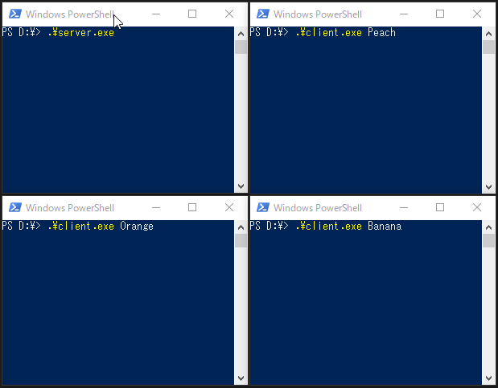

# Simple examples of how to use [grpc-dart](https://github.com/grpc/grpc-dart)

* [unary_greet](./unary_greet)
    * An example of Unary RPCs similar to the official [helloworld](https://github.com/grpc/grpc-dart/tree/master/example/helloworld) with slightly more info exchanged in both directions

* [bidi_calc](./bidi_calc)
    * An example of Bidirectional streaming RPCs

* [bidi_chat](./bidi_chat)
    * An example of broadcast from a server to multiple clients by Bidirectional streaming RPCs
    * A nickname needs to be provided when you run lib/client.dart.  

## Related articles

* [DartでgRPCを使う](https://qiita.com/kabochapo/items/6848457ea7a966baf957)
    * Refer to this post for explanations (Japanese) and screencasts.
